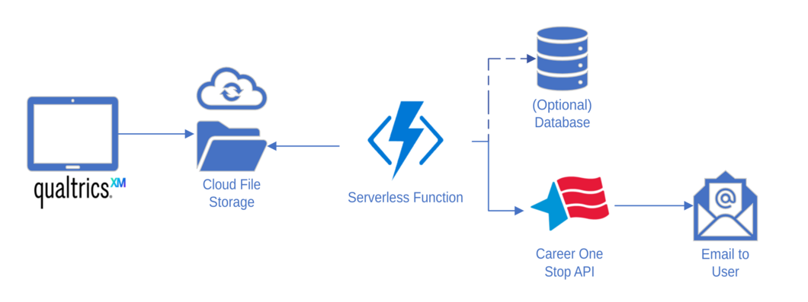
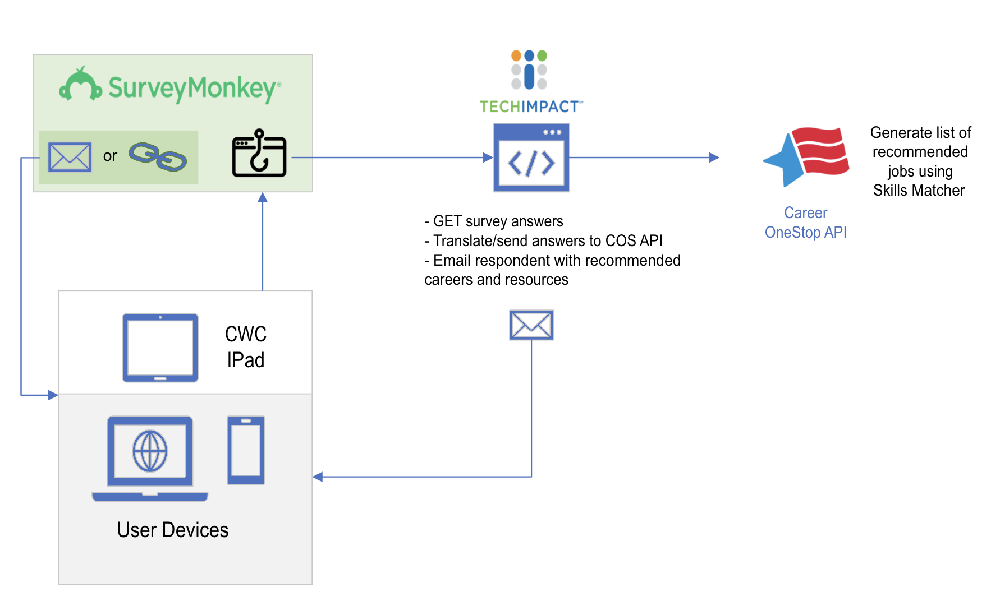

## Project Overview:

DWDB wants to port this [career skills matcher survey](https://www.careeronestop.org/Toolkit/Skills/skills-matcher.aspx) from CareerOneStop to SurveyMonkey. This will allow us to incorporate additional questions, run analytics on responses, and deliver the questionnaire via IPad.  

### **Architecture (v1)**: 

The previous design for the project assumed the survey would only be delivered offline via IPad. When back online, survey administrators would export responses in an excel file to a cloud storage bucket and trigger a serverless workflow that transformed the data, sent it to the CareerOneStop API, received its list of recommended jobs, and sent a customized email to each respondent based on their list of recommendations.

### **Architecture (v2)**: 

To allow respondents to also take the quiz themselves on their own devices, we will need to deploy an app with the SurveyMonkey API and connect it to a webapp of our own. When a survey response is [collected](https://help.surveymonkey.com/en/surveymonkey/send/collector-options/), a webhook will trigger our web app to make a GET request to the SurveyMonkey app for the new response information. Our app will receive the survey answers in JSON from SurveyMonkey, translate/send them in a readable format to the CareerOneStop Skills Matcher API, and email the respondent with job recommendations from the Skills Matcher along with other career resources.

In addition to the career skills questions contained in the Skills Matcher survey, the Survey Monkey survey we're using also asks the following questions: 

* The name of the CWC worker told them about the survey 
* Whether they are taking the survey in person or online 
* What zip code they currently live in 
* Date of Birth
* Race/Ethnicity 
* Highest level of education
* What professional certifications they hold (if any)
* Whether they completed any job training programs in the past
* Perceptions on local job opportunities, in which industries people they know work, and how people hear about job opportunities. 

### Links 

**SurveyMonkey**
* [Official Survey](https://www.surveymonkey.com/r/MSFV98P)

* [Demo Survey](https://www.surveymonkey.com/r/WBVDKG9) (for development purposes)

* [API Documentation](https://api.surveymonkey.com/v3/docs)

**CareerOneStop**
* [Register](https://www.careeronestop.org/Developers/WebAPI/registration.aspx) for API key and user id.
* [API Explorer](https://api.careeronestop.org/api-explorer/) - read API documentation and send test queries.

* [Skills submit endpoint](https://www.careeronestop.org/Developers/WebAPI/SkillsMatcher/submit-skills.aspx) - Submit Skills Matcher Answers
  * Submit request containing JSON ([example](https://www.careeronestop.org/TridionMultimedia/skills-matcher-json-data.json)) of work-related skills and your personal rating in each (from Beginner to Basic)
  * Receive a JSON response with a list of matching jobs  
    * See `data/skills-submit-api/` for an example request (same as above) and response retrieved via the [API explorer](https://api.careeronestop.org/api-explorer/home/index/SkillsMatcher_Submit_SKA)

* [Get skills endpoint](https://www.careeronestop.org/Developers/WebAPI/SkillsMatcher/get-skills.aspx) - See Skills Matcher Questions
  * Receive a JSON representation of the survey questions and answer values
    * See `data/get-skills-api/response.json`, also retrieved from API explorer
